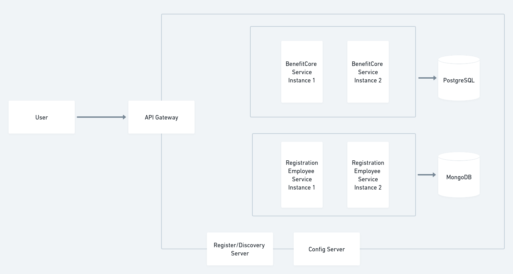
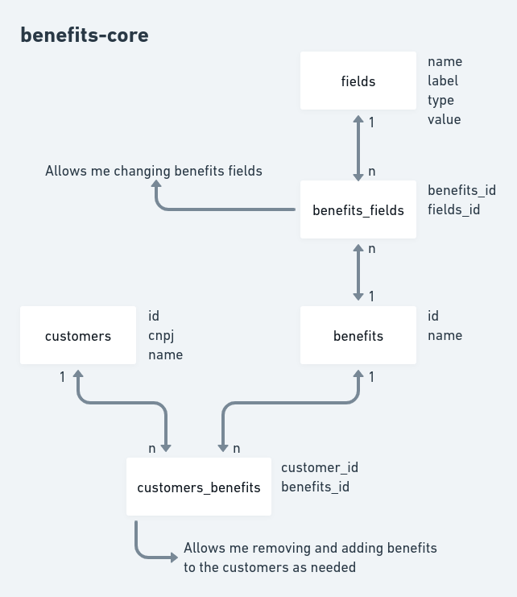
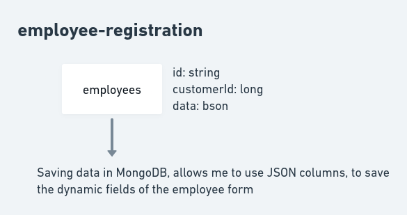

# Pipo Project

## Problem/Motivation
We have to solve a problem about health benefits. 

Currently, every customer has to register some employee information in Benefits sheets. 

This process is done manually, then a big number of issues  can be found, like: 

    - Wrong information
    - Repetition of write
    - Different data to the same information (differents sheets)
    - Process slowness

## Solution
To solve that, I did a entire application, with frontend and backend, where the customer 
can save the employee data, without problem and with more agility.

To this, I developed two features: employee registration, report employee.

### Employee Registration
To register the employee, you will need first to select the customer that he is work from,
select the benefits that he chose to him, and the Application will return the fields that
belong to the benefits chosen.

After that, input the data and click on finish button.

### Report Employee
After registering the employee, click on the button, report employee.

first select the customer, second the benefit that you want to get the information, then
click on the button below.

The application will show only the data about the benefit selected.

## How to run the project

### Backend
You will need to have Java 11 on your desktop.

Take sure that the ports 8080 and 8081 are available.

  - benefit-core
  
    ``` 
        cd ./backend/benefits-core/target
        java -jar benefits-core-0.0.1-SNAPSHOT.jar
    ``` 

  - employee-registration
    - To this service, you will need to have MongoDB installed on your desktop, to this, to this click on the link below.
  
        https://docs.mongodb.com/manual/installation/

    - After installed, you need to run the database, follow the steps below if you are using Linux.

        ```
            sudo systemctl start mongod
        ```

    - Now, run the application service
  
        ``` 
            cd ./backend/employee-registration/target
            java -jar employee-registration-0.0.1-SNAPSHOT.jar
        ``` 

### Frontend
You will need to have NPM and ANGULAR installed in your desktop.

[Follow these steps to install NPM if you have Linux.](https://linuxize.com/post/how-to-install-node-js-on-ubuntu-18.04/)

After installed NPM, execute to install ANGULAR: 

```npm install -g @angular/cli```

Now you only have to run these codes below:

    cd ./frontend
    npm i
    ng serve

### Microservices Architecture Design



### Database Benefits Core


### Database Employee Registration



